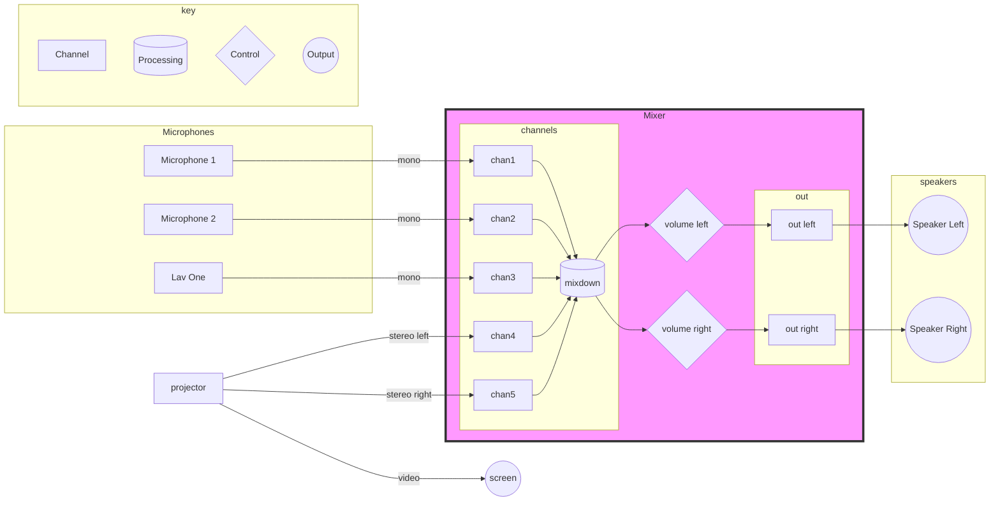
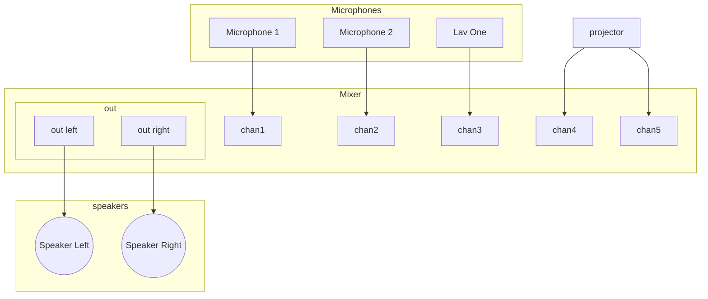

## Install [[Markdown Mermaid Preview|https://marketplace.visualstudio.com/items?itemName=bierner.markdown-mermaid]]

## 20th Floor Atrium PA System

```mermaid
flowchart LR
    ol --> sl
    or  --> sr
    m1 --> |mono| chan1
    m2 --> |mono| chan2
    l1 --> |mono| chan3
    projector --> |stereo left|chan4
    projector --> |stereo right|chan5
    subgraph Microphones
    direction RL
      m1[Microphone 1]
      m2[Microphone 2]
      l1[Lav One]
    end
    subgraph Mixer
      subgraph channels
        chan1 --> mixdown
        chan2--> mixdown
        chan3--> mixdown
        chan4--> mixdown
        chan5--> mixdown
      end
      mixdown[(mixdown)]
      mixdown --> vl{volume left}
      mixdown --> vr{volume right}
      vl--> ol
      vr--> or
      subgraph out
        ol[out left]
        or[out right]
      end
    end
    subgraph speakers
      sl((Speaker Left))
      sr((Speaker Right))
    end
      style Mixer fill:#f9f,stroke:#333,stroke-width:4px
    subgraph key
      Channel
      Processing[(Processing)]
      Control{Control}
      Output((Output))
    end
  projector -->|video|screen((screen))
```

## 20th Floor Atrium PA System

```mermaid
flowchart TB
    ol --> sl
    or  --> sr
    m1 --> chan1
    m2 --> chan2
    l1 --> chan3
    projector --> chan4
    projector --> chan5
    subgraph Microphones
    m1[Microphone 1]
    m2[Microphone 2]
    l1[Lav One]
    end
    subgraph Mixer
    chan1
    chan2
    chan3
    chan4
    chan5
      subgraph out
      ol[out left]
      or[out right]
      end
    end
    subgraph speakers
    sl((Speaker Left))
    sr((Speaker Right))
    end

```

