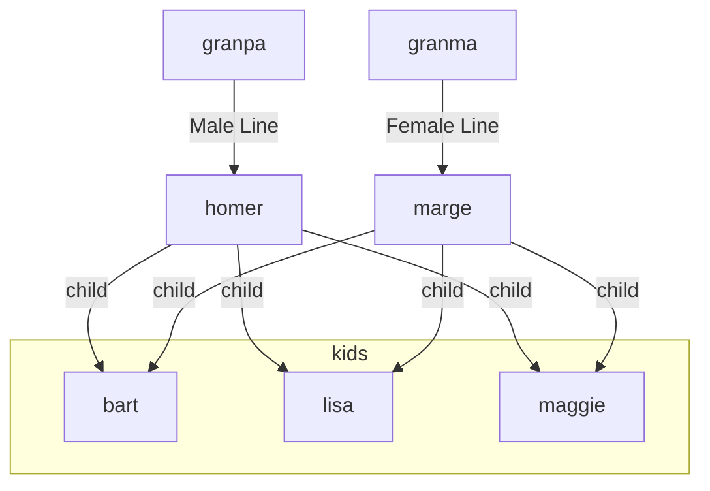
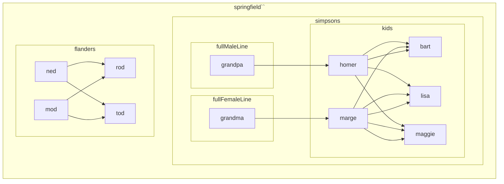

## Google Spell Check

### Concept

I'd like to be able to paste appended onto the last .namespace a note:

> _with `'Jack Kerouac'` in the pasteboard_ & you want to paste creating a namespace from `lit.beats` creating 'lit.beats.jack-kerouac'

To make this easier, whatever text is in the clipboard will have the following operations preformed on it.

1. It will be downcased.
2. All whitespace will be stripped from the ends.
3. Remaining whitespace will be collapsed to maximum one space in a row.
4.

I'd also like to be able to paste replacing the last namespace.

### Use Case

I need to be able to spell "Jack Kerouac" so I can create lit.beats.members.jack-kerouac while I'm sitting at lit.beats.members above children lit.beats.members.allen ginsberg and lit.beats.members.william-s-burroughs, both of which I had to go to google to spell check, because CodeSpell doesn't have a chance here.

So to create each of these notes I had to

- alt tab over to google
- throw my best guess at the name in
- find the correct spelling in the suggestions
- get it into the paste board somehow..this can be done from the keyboard.
- copy it into text
  - probably in vscode.
  - probably the note you're working in...
  - paste it
  - possibly down case it
    - so that means you have to select it
  - somehow replace whitespace with dashes...
  - put it back in the clip board
  - open the new note dialoag
  - paste it at the end in the case of the first note
    - delete the last name space and paste it as the child of it's siblings parents if you want to make a sibiling note.
  - Return to your original note and declutter it.

## Durandal A markup Laungage to create Drendal Graph Families and render the graph results in real time. [[Touch Designer|tags.TouchDesigner]]

### Select text, by key command call up dialog, create children, siblings, or parents easily.

- select text
- hit key combo
  - Dialog:
    - create sibling
      - link
        - leave link
        - no link
      - tag
        - tag all
        - tag parent
        - tag siblings
        - tag siblings and self
        - tag none
  - create child
    - create sibling
      - Link
        - leave link
        - no link
      - Tag
        - tag all
        - tag parent
        - tag siblings
        - tag siblings and self
        - tag none
- select plain text array

  - white space within words could be presumably collapsed and replaced with dashes
    > [gas-station, residence, warehouse, farm-house, hen-house, out-house, and dog-house]
  - Dialog:

    - create children
    - create siblings
    - create lineage
    - inject lineage [glitch in the matrix]
    - create descendants

## Most Baisc

### EASY

    - create one child

### hard

    - create one sibling

### harder

    - create one parent

### harest

    - create "synapses" [fully formed families and civilizations that can be placed anywhere in the tree with a preview node graph.]

### requires a language capable of doing everything dendron can do, in a single line.

## #Need [[Need an image of a note here]]

So it has to...
_in a single line mind you_

- create child
  -include
  - META:
    - title
    - front matter
      - key/pair definitions
      - should probably accept a yaml file
      - should absolutely accept a yaml file
    - desc
    - prose
      - new line
      - headings 1-6
      - lists
      - num lists
      - itallics
      - bold
      - links
      - backlinks
      - visual links
      - tags

A hyphen denotes an objects attributes

Objects are seperated by commas.

#### Basic Dendron Object

[ t:note ]

#### creates

---

```
id:asdfasd
title: note
desc: ''
time: 1234567890
time: 1234567890
```

---

[ t:note, p: some words ]

#### creates

---

```
id:asdfasd
title: note
desc: ''
time: 1234567890
time: 1234567890
```

some words

---

[child-t:title, f=[[somefile.yml]], tmp=[[some-template]], d:description, p-##Title, some prose \n \n ###\_ittalic_header **bold word** \_list **indented \#\_1. #**2. [[backlink]] \![\[vislink]], t-#family]

#### creates

---

```
id:abdfkalsdjflkdsj
title: title
desc: description
rest: of the yaml file
```

## Title

some prose

## _Italic Header_

**bold word**

- list
  -- indented

[[backlink]]

!\[[visual link]]

#Family

---

# Step One: Create Variables

```
           {
            gs:abraham-jebediah-simpson-ii,      // grandpa

            jb:jacqueline-bouvier                // grandma

            h:homer-jay-simpson,                // homer

            ms:marge-simpson                    //marge

            b:bartholomew-jojo,                // bart

            l:lisa-marie,                      // lisa

            mg:margaret-evelyn-lenny-simpson,  // maggie

            kids:b|l|mg,                       // the kids
            sml: gs --> hs                    // male-line
            sfl: jb --> ms                    // female-line
        }
```

## Step Two

- create village

  > [ grandpa, homer | (bart, lisa, maggie); grandma, marge | (bart, lisa, maggie) ]

  - grandpa
    - homer
  - grandma
    - maggie
      - bart
      - lisa
      - maggie



- create village

  > [ grandpa, homer | (bart, lisa, maggie); grandma, marge | (bart, lisa, maggie); ned | (rod, tod); mod | (rod, tod) ]



- > parens (hold siblings)
- create civilization

  - > [ grandpa, homer | (bart, lisa, maggie)],
  - > []
  - > Create Variables

        ```

        //variable:string-content, decendant:homer |his:child1, his:child2,

        // varriables can be called in arrays
        [gs, hs | (bart, lisa, maggie)]
        // arrays can be acted upon to create families of nodes in the graph.
        ```

```mermaid
  flowchart LR
    subgraph sml
      gs[abraham-jebediah-simpson-ii] --> h[homer-jay-simpson]

```

        ```
        [abraham-jebediah-simpson-ii, homer-jay-simpson, ],
        //comments could function as tags.
        ```

        - > [gs, h, ]

    - > [ jackie, marge | bart, lisa, maggie] = [ jackie, marge | pattie >< selma ]
      - > `text` is a name
      - > `**|**` denotes children
        > -> `{creates:variables, }`

## Auto Structure

I be able to create all neccisary structre when creating a new note embedded in a sereis of parents that heretofore have not existed.
